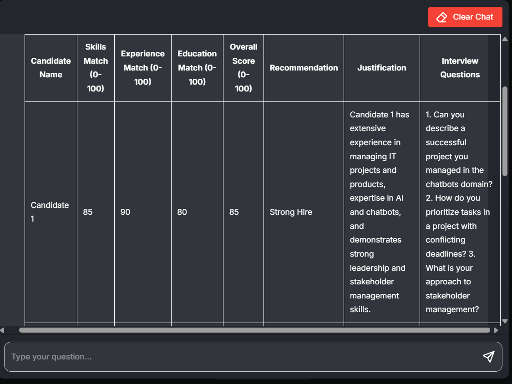

# ai-hr-assistant


AI HR Assistant is an AI-powered recruitment assistant that analyzes one or multiple candidate resumes, evaluates candidates against predefined criteria, and generates personalized interview questions.
The project is built on Flowise and uses LLM + Retrieval + Structured output.

# Features

- Analyze a single resume
- Analyze multiple resumes simultaneously
- Extract candidate information from PDF resumes
- Compares the candidate with the vacancy
- Evaluate candidates by:
    Skills Match
    Experience Match
    Education Match
    Overall Score
- Generate hiring recommendation:
    Strong Hire
    Hire
    Consider
    Reject
- Generate personalized interview questions
- Return results in structured JSON format
- Multi-candidate comparison

# Example

The agent was tested on three candidate resumes simultaneously.

It generated: 
- individual candidate scores; 
- hiring recommendations; 
- strengths and weaknesses; 
- personalized interview questions; 
- structured JSON output.


# Architecture

Resume PDF(s)
      ↓
Recursive Character Text Splitter
      ↓
OpenAI Embeddings
      ↓
In-Memory Vector Store
      ↓
Retriever Tool
      ↓
Tool Agent and Buffer Window Memory
      ↓
ChatOpenAI
      ↓
Structured Output Parser
      ↓
Candidate Evaluation JSON

# Tech Stack

- **Flowise** — AI workflow / agent orchestration
- **OpenAI GPT** — candidate analysis and reasoning
- **OpenAI Embeddings** — semantic representation of resume content
- **In-Memory Vector Store** — temporary vector storage
- **Retriever** — retrieval of relevant resume information
- **Structured Output Parser** — structured JSON generation
- **PDF File Loader** — resume ingestion
- **Recursive Character Text Splitter** — document chunking

# Knowledge Base

The knowledge source is provided dynamically through uploaded candidate resumes in PDF format.

Input:
Candidate(s) Resume (PDF)
Job description

Processing:
PDF → Text → Chunks → Embeddings → Vector Store

Retrieval:
Relevant resume information → LLM

Output: 
- Ranked candidate list
- Individual scores
- Hiring recommendationv

# Evaluation Logic

Each candidate is evaluated using four criteria:
- Skills Match
- Experience Match
- Education Match
- Overall Score

The Overall Score is assigned on a 0 - 100 scale.

The agent evaluates candidates using predefined criteria and generates an overall score and hiring recommendation.
The recommendation is deterministically mapped to the Overall Score using predefined thresholds.

Recommendation:
**85 - 100**`Strong Hire`
**70 - 84** `Hire`
**50 - 69** `Consider`
**0 - 49** `Reject`

AI-generated evaluations are intended to support recruiter decision-making and should always be reviewed by a human.
# Project Structure

ai-hr-assistant/
│
├── flowise/
│   └── AI_HR_Assistant_v1.1.0.json
│
├── screenshots/
│   ├── architecture.png
│   └── example-output.png
│
└── README.md

# Installation

Before importing the project, make sure you have: 
- Flowise installed (Prerequisites for local installation: Node.js / Docker)
- An OpenAI API key

1. Clone this repository (to install git https://git-scm.com/install)
```bash
git clone https://github.com/1845302-ops/ai-hr-assistant.git
```
2. Import the file: ``` flowise/AI_HR_Assistant_v1.1.0.json ```
3. Open the AI HR Assistant flow
4. Configure OpenAI API credentials
5. Upload one or multiple PDF resumes
6. Run the agent

# Usage

Single candidate
- Upload one resume and ask the agent to evaluate the candidate.

Multiple candidates
- Upload multiple resumes and ask the agent to compare the candidates.

For example, ask an agent: "Evaluate these three candidates for the Project Manager position."

Candidate A
Skills Match: 85
Experience Match: 78
Education Match: 80
Overall Score: 82
Recommendation: Hire

Candidate B
...

Candidate C
...

**Output (JSON / Summary):**
- **Candidate A:** Overall Score 82/100 (`Hire`) 
- **Candidate B:** Overall Score 91/100 (`Strong Hire`) 
- **Candidate C:** Overall Score 45/100 (`Reject`)

Also, when making a request, the agent can indicate the candidate's strengths and weaknesses and generate interview questions for the selected candidate.

# Limitations

- Currently works with PDF resumes
- Evaluation depends on the quality and completeness of the provided resume
- Hiring recommendations are AI-generated and require human review
- No ATS integration yet
- No persistent candidate database
- No automatic communication with candidates
- No authentication or multi-user interface

# Potential Future Improvements

- ATS integration
- Google Sheets / Airtable integration
- Job Description parser
- Automatic extraction of job requirements
- Candidate ranking against a specific vacancy
- Candidate database
- Candidate status tracking
- Automatic candidate emails
- Interview feedback analysis
- Export to CSV / Excel
- Web interface
- Multi-user support
- Job Description → Evaluation Criteria
